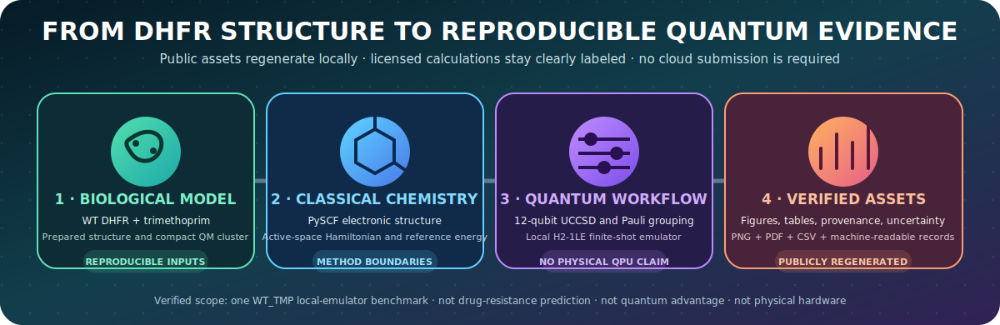
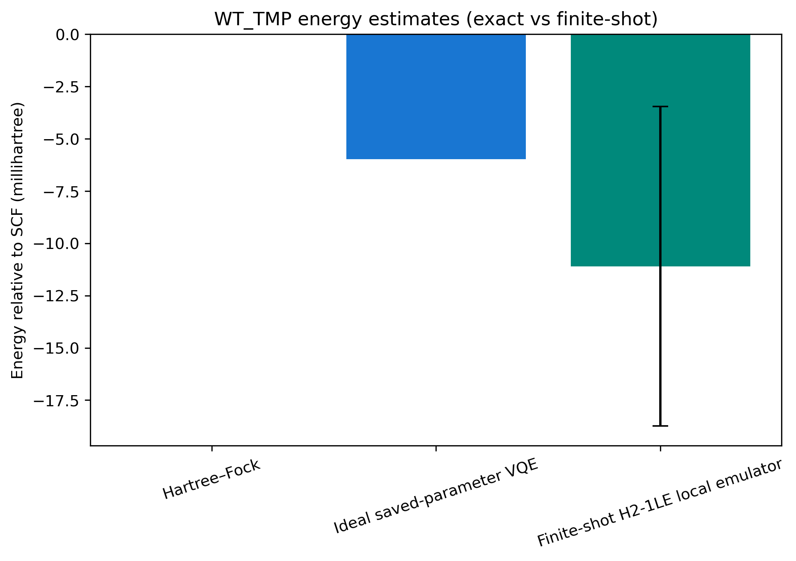
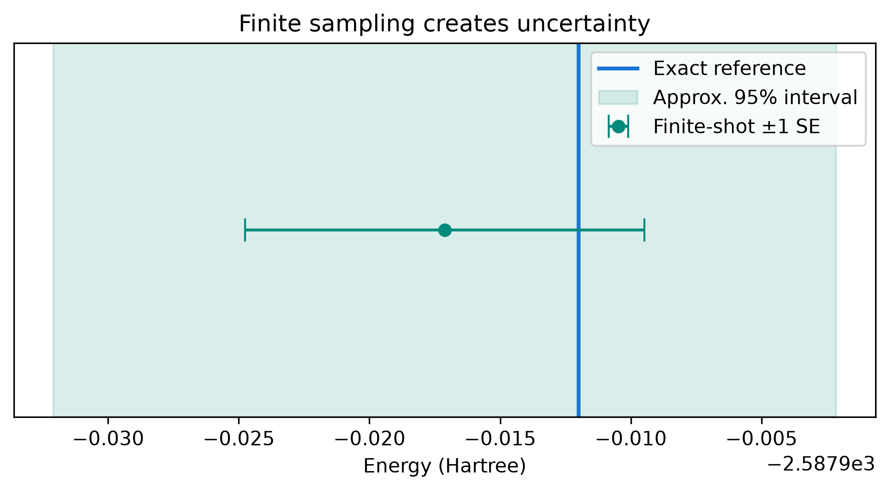
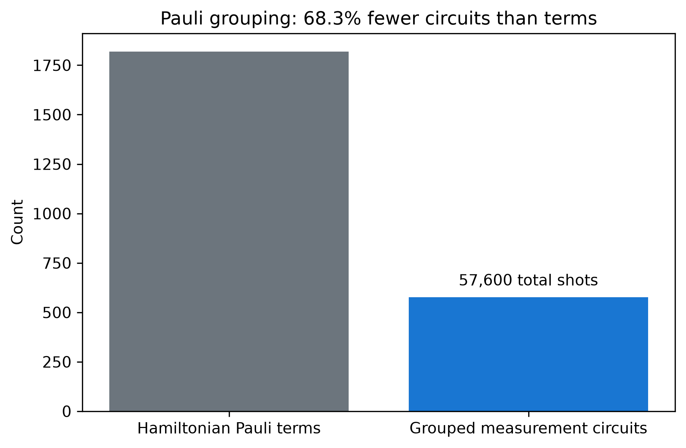
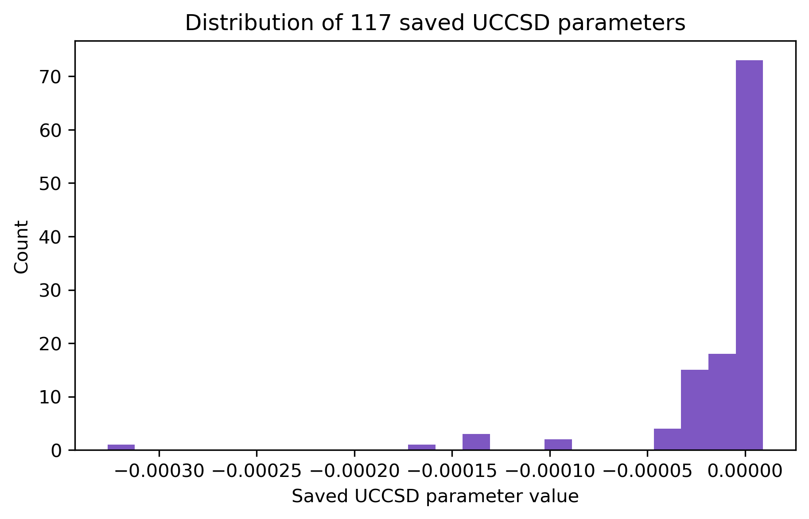
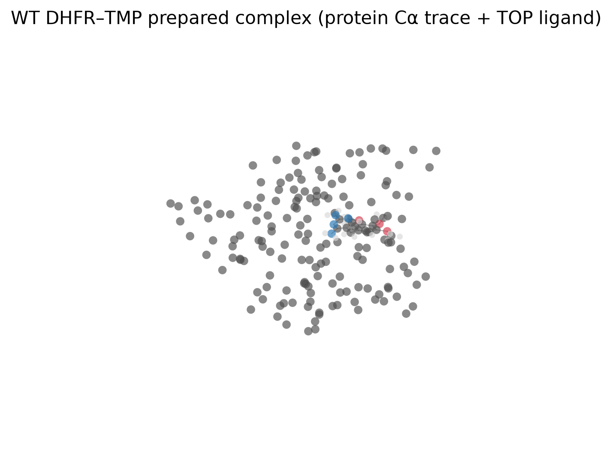
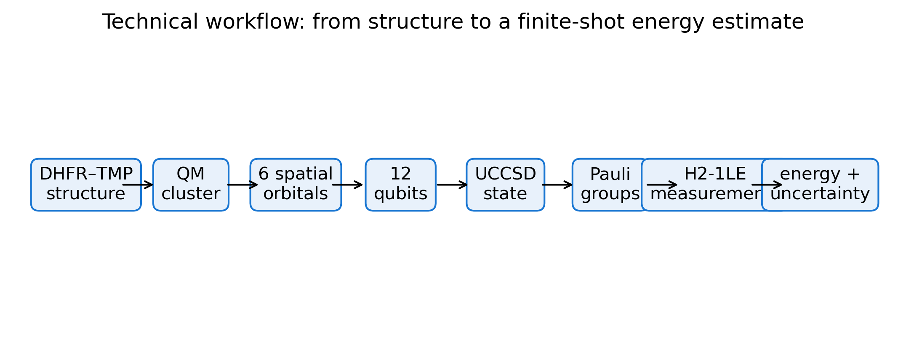

<p align="center"></p>

<h1 align="center">Quantum-Enabled Analysis of DHFR-Mediated Drug Resistance</h1>

<p align="center"><strong>A visual, reproducible workflow connecting DHFR structural models, classical electronic structure, active-space quantum chemistry, and finite-shot local-emulator measurements.</strong></p>

<p align="center">
  <a href="https://github.com/Braytech-Findings/dhfr-inquanto-resistance/actions/workflows/tests.yml"></a>
  
  
  
  
  
  
  
  <a href="LICENSE"></a>
</p>

<p align="center">
  <a href="#start-here"><strong>Start here</strong></a> ·
  <a href="#verified-result"><strong>Verified result</strong></a> ·
  <a href="#visual-results"><strong>Visual results</strong></a> ·
  <a href="#reproduce-everything"><strong>Reproduce everything</strong></a> ·
  <a href="docs/FIGURE_GALLERY.md"><strong>Figure gallery</strong></a> ·
  <a href="docs/methods.md"><strong>Methods</strong></a> ·
  <a href="manuscript/README.md"><strong>Manuscript</strong></a>
</p>

> [!IMPORTANT]
> **Verified scope:** one compact `WT_TMP` active-space model evaluated with classical and local quantum-emulator methods. This repository does not claim a drug-resistance prediction, binding free energy, clinical result, physical-hardware result, or quantum advantage.

## Start here

<table>
<tr>
<td width="25%" align="center"><strong>🧬 Biology</strong><br><a href="docs/scientific-background.md">Scientific background</a><br><a href="docs/GLOSSARY.md">Plain-language glossary</a></td>
<td width="25%" align="center"><strong>⚛️ Methods</strong><br><a href="docs/methods.md">Technical methods</a><br><a href="docs/backend-status.md">Backend status</a></td>
<td width="25%" align="center"><strong>📊 Evidence</strong><br><a href="docs/FIGURE_GALLERY.md">Figure gallery</a><br><a href="docs/RESULTS.md">Verified results</a></td>
<td width="25%" align="center"><strong>🔁 Recreate</strong><br><a href="docs/REPRODUCIBILITY.md">Full reproduction guide</a><br><a href="#one-command-public-reproduction">One command</a></td>
</tr>
</table>

### Beginner explanation

Proteins are tiny biological machines. **Dihydrofolate reductase (DHFR)** helps cells make molecules needed for growth. **Trimethoprim (TMP)** interferes with bacterial DHFR. Genetic changes can alter the protein and may contribute to drug resistance.

This project combines biology, molecular modeling, chemistry, and quantum computing to study a small selected electronic model of DHFR with TMP. The active-space analogy is like studying one classroom in a large school: useful for focused analysis, but not a complete description of the whole building.

### Technical explanation

The completed benchmark uses a `WT_TMP` compact QM-cluster model, STO-3G basis, six selected spatial orbitals, a 12-qubit UCCSD ansatz, and Pauli-grouped finite-shot expectation estimation. Quantinuum InQuanto formulates the specialized quantum-chemistry workflow. Read the [methods](docs/methods.md), [scientific background](docs/scientific-background.md), and [glossary](docs/GLOSSARY.md).

## Research question

Can reproducible, mutation-specific electronic interaction descriptors help frame future studies of why TMP and 4-DTMP can follow different DHFR resistance trajectories?

The current repository establishes workflow components and one `WT_TMP` local-emulator benchmark. It does **not** yet answer the full four-system biological question.

## Project pipeline

```mermaid
flowchart LR
  A[Biological question] --> B[DHFR system selection]
  B --> C[Structure and QM-cluster preparation]
  C --> D[Classical electronic structure]
  D --> E[Active-space Hamiltonian]
  E --> F[UCCSD state and Pauli grouping]
  F --> G[Local H2-1LE finite-shot measurements]
  G --> H[Energy and uncertainty]
  H --> I[Careful interpretation]
```



<p align="center"></p>

Stages `A–C` connect biology and molecular modeling; `D` is classical computation; `E–G` are quantum-chemistry and circuit stages; `H–I` are analysis and interpretation.

## Verified result

| Item | Verified value | Meaning |
|---|---:|---|
| System | `WT_TMP` | One wild-type DHFR–TMP active-space model |
| Basis | STO-3G | Minimal basis and a major methodological limitation |
| Ansatz | UCCSD | 12 qubits and 117 saved parameters |
| Hamiltonian | 1,819 Pauli terms | Grouped into 576 measurement circuits |
| Ideal reference | `-2587.912001526413 Ha` | Saved-parameter expectation value |
| Finite-shot estimate | `-2587.917118821447 Ha` | 57,600-shot local H2-1LE noiseless-emulator result |
| Standard error | `0.007647045141 Ha` | Finite-shot sampling uncertainty only |
| Execution environment | Local emulator | Not Nexus-hosted and not physical quantum hardware |

The finite-shot value differs from the ideal saved-parameter reference by `-0.005117295034 Ha`, which is smaller than the reported standard error. Read [RESULTS.md](docs/RESULTS.md), the [machine-readable provenance](results/publication/data/verified_quantum_provenance.json), and [backend-status table](docs/backend-status.md).

## Visual results

<table>
<tr>
<td width="50%" align="center">
<a href="results/publication/figures/energy_comparison.png"></a><br>
<strong>🟦 Energy comparison</strong><br>Classical, ideal saved-parameter, and finite-shot values shown relative to the SCF reference.
</td>
<td width="50%" align="center">
<a href="results/publication/figures/statistical_uncertainty.png"></a><br>
<strong>🟧 Sampling uncertainty</strong><br>The interval describes shot noise, not structural, basis, active-space, or biological uncertainty.
</td>
</tr>
<tr>
<td width="50%" align="center">
<a href="results/publication/figures/hamiltonian_compression.png"></a><br>
<strong>🟪 Measurement workload</strong><br>1,819 Pauli terms are grouped into 576 measurement circuits.
</td>
<td width="50%" align="center">
<a href="results/publication/figures/parameter_distribution.png"></a><br>
<strong>🟩 UCCSD parameter distribution</strong><br>117 values define the fixed trial state; magnitude alone is not biological importance.
</td>
</tr>
<tr>
<td width="50%" align="center">
<a href="results/publication/figures/molecular/wt_tmp_complex_overview.png"></a><br>
<strong>🧬 Prepared WT_TMP structure</strong><br>A reproducible programmatic render, not an experimental image.
</td>
<td width="50%" align="center">
<a href="results/publication/figures/workflow_technical.png"></a><br>
<strong>⚛️ Technical workflow</strong><br>Structure → active space → qubits → finite-shot energy and uncertainty.
</td>
</tr>
</table>

Every publication figure has a PNG, PDF, source table or provenance record, and accessibility documentation. Browse [FIGURE_GALLERY.md](docs/FIGURE_GALLERY.md), [FIGURE_CAPTIONS.md](docs/FIGURE_CAPTIONS.md), and [FIGURE_ALT_TEXT.md](docs/FIGURE_ALT_TEXT.md).

## Reproduce everything

### Reproducibility levels

| Level | What it recreates | Requirements |
|---|---|---|
| Public | Tests, tables, figures, manifests, provenance summaries, molecular render | `environment.yml`; no credentials |
| Public + optional | R figures and manuscript PDF | R packages and/or LaTeX toolchain |
| Licensed local | 576-circuit finite-shot H2-1LE calculation | Authorized InQuanto stack and excluded local files |
| Cloud / physical hardware | Not part of the verified benchmark | Not run or claimed by default |

### One-command public reproduction

```bash
conda env create -f environment.yml
conda activate dhfr-qc
python scripts/reproduce_everything.py
```

Preview every command without executing it:

```bash
python scripts/reproduce_everything.py --dry-run --include-r --include-manuscript
```

Include optional R figures:

```bash
python scripts/reproduce_everything.py --include-r
```

Include the optional manuscript build:

```bash
python scripts/reproduce_everything.py --include-manuscript
```

The runner is local and public-data-only. It never authenticates to Nexus or submits provider jobs.

### Makefile shortcuts

```bash
make help
make doctor
make reproduce
make reproduce-full
```

Read [Reproduce Everything](docs/REPRODUCIBILITY.md) for exact expected outputs, troubleshooting, the licensed local path, multi-gigabyte excluded checkpoints, package versions, result verification, and safety boundaries.

## Installation

```bash
conda env create -f environment.yml
conda activate dhfr-qc
pytest -q
```

`dhfr-qc` contains the public scientific stack and `qnexus==0.46.0`. It does not install licensed InQuanto packages. In the verified workspace, the separate licensed environment is named `dhfr-inquanto` and contains InQuanto 6.1.0, pytket 2.18.1, pytket-quantinuum 0.57.0, pytket-qiskit 0.77.0, PySCF 2.13.1, and NumPy 2.4.6.

## Prespecified systems and endpoint

| System | Protein | Ligand | Structural source |
|---|---|---|---|
| `WT_TMP` | WT | TMP | 6XG5 |
| `WT_4DTMP` | WT | 4-DTMP | Modeled from 6XG5 |
| `L28R_TMP` | L28R | TMP | 6XG4 |
| `L28R_4DTMP` | L28R | 4-DTMP | Modeled from 6XG4 |

The future primary contrast is:

```text
D = [E(L28R, 4-DTMP) − E(WT, 4-DTMP)]
  − [E(L28R, TMP) − E(WT, TMP)]
```

Raw total energies from systems with different atom counts must not be interpreted as interaction energies. A consistent interaction-energy definition is required across all four systems.

## Code workflow

Run commands from the repository root.

```bash
# Download and checksum structures
python scripts/download_pdbs.py

# Regenerate publication assets
python scripts/build_publication_assets.py

# Regenerate the molecular view
python scripts/render_molecular_3d.py

# Public quality checks
ruff check .
pytest -q
```

The full structure preparation, ligand modeling, PySCF, active-space, InQuanto, endpoint-analysis, and provider-safety commands are documented in [REPRODUCIBILITY.md](docs/REPRODUCIBILITY.md) and [methods.md](docs/methods.md).

## Nexus and execution boundary

The verified finite-shot result is local H2-1LE only. A state-preparation circuit by itself does not calculate molecular energy. Backend visibility or an “online” label does not prove execution entitlement.

Safe diagnostics and non-submitting planning tools include:

```bash
python scripts/diagnose_quantinuum_access.py
python scripts/test_quantinuum_access.py \
  --nexus-emulator \
  --backend H2-1SC \
  --dry-run
```

`H2-1SC` is a syntax checker. Never commit tokens, cookies, populated `.env` files, project secrets, or unsanitized provider responses.

## Claims this project does not make

- Cluster interaction energies are not binding free energies.
- Local emulator execution is not physical quantum-hardware execution.
- The study does not claim clinical efficacy, resistance prevention, a new antibiotic, or quantum advantage.
- One `WT_TMP` model does not answer the future four-system resistance question.
- Variant panels, active spaces, poses, and optimizer settings must not be selected using favorable downstream quantum results.

## Repository map

```text
configs/                Prespecified systems, models, and protocol settings
data/                   Public parameters, structures, and documentation
scripts/                Preparation, analysis, plotting, reproduction, and guarded access tools
results/publication/    Verified summaries, figures, source data, and provenance
results/quantum/        Local-result manifest and excluded-checkpoint documentation
docs/                   Beginner, methods, results, limitations, figures, and backend guides
manuscript/             LaTeX source for the research report
tests/                  Public integrity, safety, and publication-asset tests
visualization/          Molecular rendering recipes and interactive viewer assets
```

## Project status

| Status | Scope |
|---|---|
| ✅ Completed locally | `WT_TMP` ideal saved-parameter expectation and finite-shot H2-1LE estimate |
| ✅ Publicly reproducible | Tests, figures, tables, source records, provenance summaries, molecular render |
| 🟨 Prepared workflow | Structure, classical chemistry, active-space, and guarded provider tools |
| ⬜ Not completed | Matched mutant comparison, noisy hosted energy calculation, physical-hardware energy, wet-lab validation |

## Citation

Use [CITATION.cff](CITATION.cff) and cite this repository:

```text
Aly, Abdellah. (2026). Quantum-Enabled Analysis of DHFR-Mediated Drug Resistance.
https://github.com/Braytech-Findings/dhfr-inquanto-resistance
```

## License and research integrity

Code and public documentation are released under the [MIT License](LICENSE). Read [LIMITATIONS.md](docs/LIMITATIONS.md), [backend-status.md](docs/backend-status.md), and [FUTURE_WORK.md](docs/FUTURE_WORK.md) before reusing the scientific conclusions.

---

<p align="center"><strong>Built to connect biology, chemistry, and quantum computing without overstating what the evidence proves.</strong></p>
