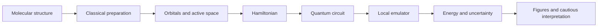

# Beginner Walkthrough

Think of this project as a ten-step story:

1. **Ask a careful question.** Could computer models help us study how a DHFR mutation changes interactions with a medicine?
2. **Choose structures.** Files in `configs/` say which protein and medicine pairs belong in the planned comparison.
3. **Prepare molecules.** Scripts clean structures and select a small region near the medicine. The full protein is too large for this quantum exercise.
4. **Do classical chemistry.** Classical software estimates electron energies and creates orbitals—useful shapes describing where electrons may be found.
5. **Choose an active space.** Researchers select a small set of important electrons and orbitals. This is like zooming in; it can also leave important things out.
6. **Build a Hamiltonian.** The chemistry problem is translated into a mathematical energy rule.
7. **Build a circuit.** InQuanto turns the small problem into quantum gates acting on qubits.
8. **Run safely.** The verified result used a local H2-1LE emulator. It imitated ideal quantum-circuit measurements on a normal computer and spent no remote credits.
9. **Collect results.** JSON and CSV files store the energy, measurement work, uncertainty, and provenance.
10. **Draw and check.** `scripts/build_publication_assets.py` reads those saved values and makes figures. A successful public check ends with `Repository validation passed`.

The project does not yet contain the matched mutant quantum result needed to answer its biological research question. That missing step is reported openly, not treated as zero.
